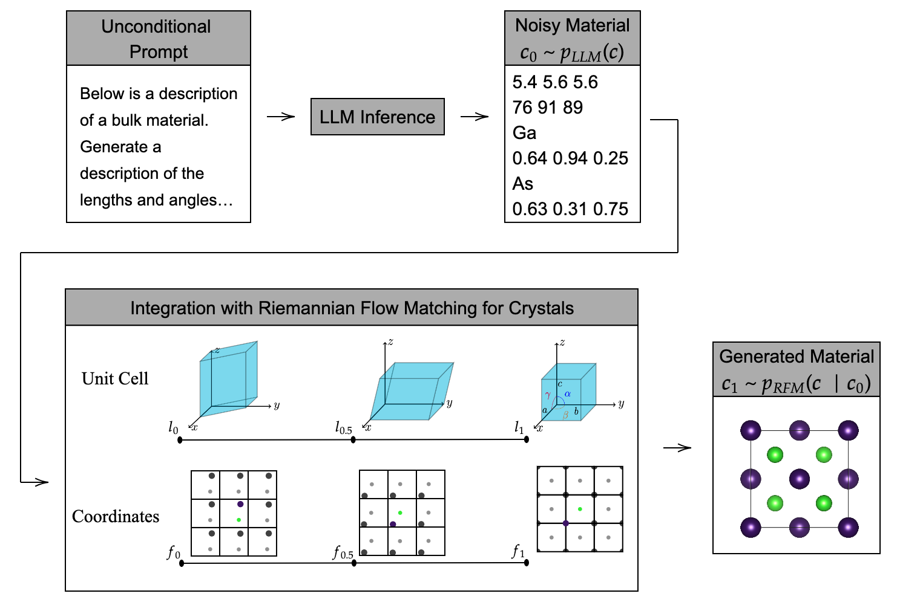
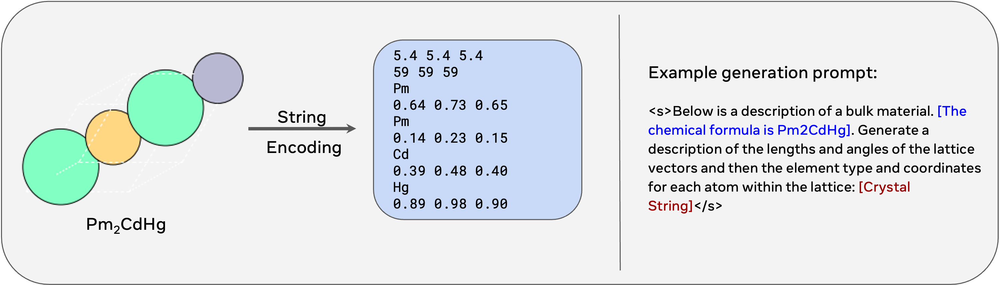
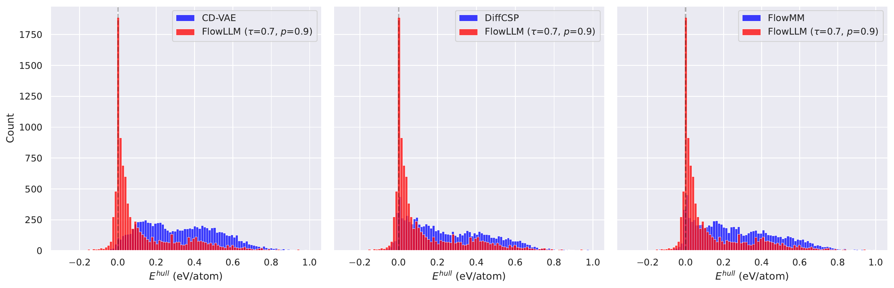
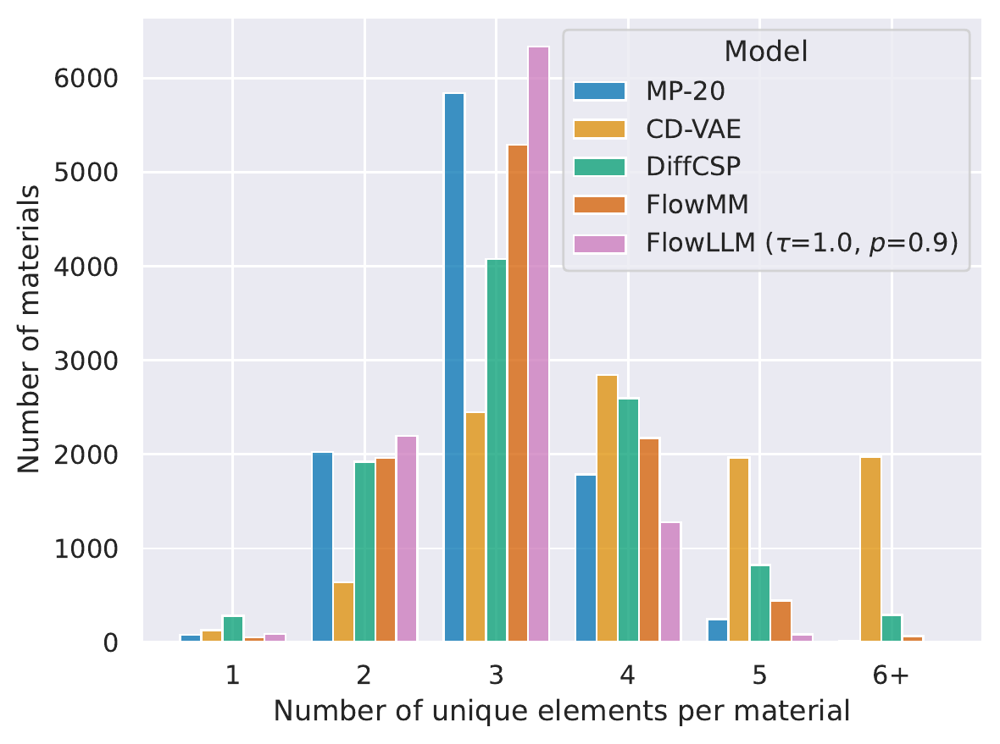
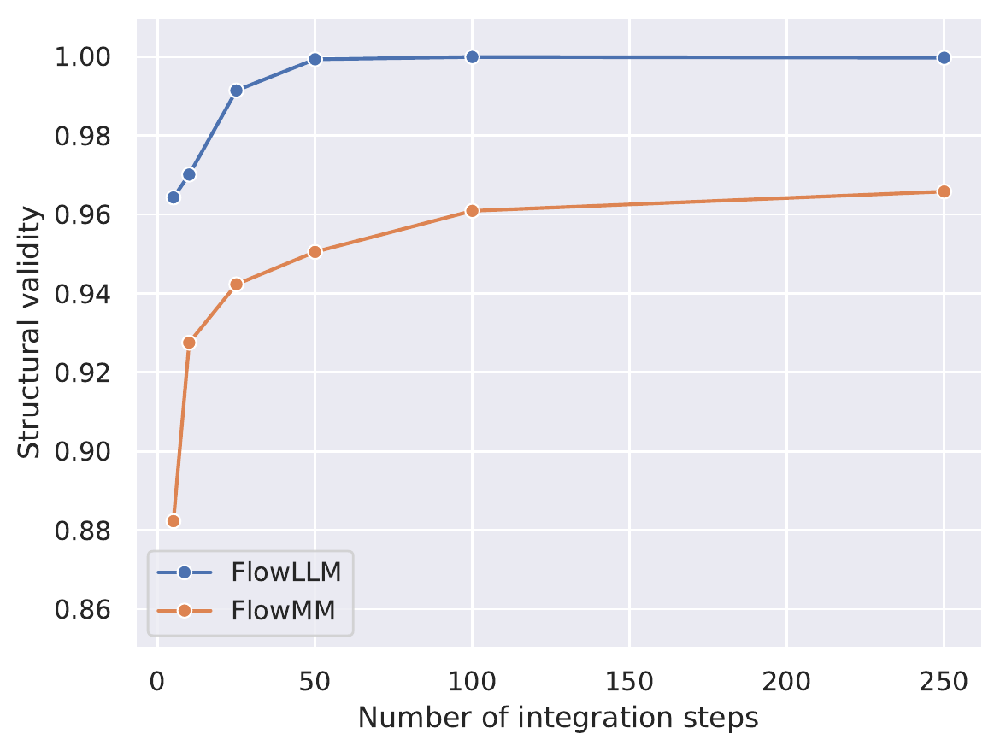

# FlowLLM: Flow Matching for Material Generation with Large Language Models as Base Distributions

## Abstract

Material discovery is a critical area of research with the potential to revolutionize various fields, including carbon capture, renewable energy, and electronics. However, the immense scale of the chemical space makes it challenging to explore all possible materials experimentally. In this paper, we introduce FlowLLM, a novel generative model that combines large language models (LLMs) and Riemannian flow matching (RFM) to design novel crystalline materials. FlowLLM first fine-tunes an LLM to learn an effective base distribution of meta-stable crystals in a text representation. After converting to a graph representation, the RFM model takes samples from the LLM and iteratively refines the coordinates and lattice parameters. Our approach significantly outperforms state-of-the-art methods, increasing the generation rate of stable materials by over three times and increasing the rate for stable, unique, and novel crystals by \\(\sim50\%\\) – a huge improvement on a difficult problem. Additionally, the crystals generated by FlowLLM are much closer to their relaxed state when compared with another leading model, significantly reducing post-hoc computational cost.

# Introduction [sec:intro]

Material discovery holds transformative potential across numerous industries including carbon capture`\cite{sriram2024odac}`{=latex}, batteries`\cite{mizushima1980batteries}`{=latex}, photovoltaics`\cite{green2014solar}`{=latex}, and energy storage`\cite{ocp_dataset}`{=latex}. However, the vastness of the chemical space has hindered experimental synthesis of the majority of possible materials. Generative models offer a promising avenue for exploring this untapped potential.

Generating crystalline materials is particularly challenging as it involves simultaneously generating both discrete (atomic types) and continuous values (atomic positions and lattice geometry). While existing approaches, namely autoregressive large language models (LLMs)`\cite{gruver2024fine,flam2023language}`{=latex} and denoising models, *e.g.*, denoising diffusion and flow matching `\cite{xie2021crystal,jiao2023crystal,zeni2023mattergen,yang2023scalable,pakornchote2024diffusion,miller2024flowmm,jiao2024space}`{=latex}, have demonstrated success, they exhibit *complementary* strengths and weaknesses. LLMs excel at modeling discrete values, but they can struggle with continuous values due to their reliance on finite precision representations. Conversely, denoising models more effectively handle continuous values and can easily ensure equivariances, but they face challenges with discrete elements.

LLMs also offer the distinct advantage of natural language prompting, enabling versatile and intuitive conditional generation. This capability is further enhanced by training LLMs on vast corpora of chemistry text, equipping them with valuable prior knowledge to generate chemically valid outputs. Queries like “Generate materials with a high bandgap and thermal stability” or “Propose a novel perovskite structure for efficient solar energy conversion” can be directly integrated into the LLM prompt, while denoising models typically require bespoke changes to the architecture and training procedure to handle conditional generation.

To harness the strengths of both paradigms, we introduce **FlowLLM**, a novel hybrid approach that uses an LLM to generate an initial material representation, which is iteratively refined with a Riemannian Flow Matching (RFM; `\cite{chen2023riemannian}`{=latex}) model. This synergistic approach allows us to effectively bridge the gap between discrete and continuous modeling, resulting in a significant improvement in the rate of generation of stable, unique, and novel (S.U.N.) materials. Such materials expand the limited knowledge we have of “material space” and are much more likely to be synthesizable than unstable generations. Our experiments demonstrate that **FlowLLM  generates stable materials at over \\(\mathbf{300\%}\\) higher rate, and S.U.N. materials at \\(\sim50\%\\) higher rate** compared to prior models, while retaining the LLM’s ability to be prompted with natural language instructions.

We offer two interpretations for the effectiveness of our approach. 1) The **LLM learns a good base distribution for RFM**: the LLM’s output distribution serves as a learned base distribution for RFM, replacing the common practice of using the uniform base distribution. Since the LLM has been trained on material data, this learned base distribution is closer to the target distribution, greatly simplifying integration with RFM. 2) **RFM refines the output of the LLM**: The LLM generates an approximate material representation due to its finite precision when handling continuous values. The RFM then refines this approximation through iterative denoising, to generate a much more accurate representation.

Our contributions are as follows:

- We introduce FlowLLM, a novel hybrid approach for materials generation that combines LLMs and RFM, effectively leveraging their complementary strengths.

- We demonstrate that FlowLLM significantly outperforms existing state-of-the-art generative models in generating novel and stable materials.

- We show through ablation experiments that our method of combining LLM and RFM models through FlowLLM significantly outperform simpler combination approaches.

Code for training the FlowLLM model is available at <https://github.com/facebookresearch/flowmm>.

<figure id="fig:flowllm_main">

<figcaption>FlowLLM generative process: the fine-tuned LLM is first prompted with an unconditional query to generate an initial material representation. This material is then iteratively transformed by the RFM model to update its atom positions and lattice parameters. The atom types are static in RFM.</figcaption>
</figure>

# Related Work [sec:related]

In the past, computational materials discovery relied on generating numerous candidate materials through random atomic substitutions in known materials`\cite{wang2021predicting}`{=latex}, followed by computationally expensive quantum mechanical screening`\cite{kohn1965self}`{=latex} to assess stability. Genetic algorithms`\cite{glass2006uspex, pickard2011ab}`{=latex}, and machine learning models trained to predict energies`\cite{schmidt2022large, merchant2023scaling}`{=latex} have accelerated this process, but the fundamental bottleneck of brute force search remains.

Recent research has focused on generative models that directly produce stable materials, bypassing brute-force search. Diffusion models, either combined with Variational Autoencoders (VAEs) for partial variable prediction`\cite{xie2021crystal}`{=latex} or jointly diffusing all variables`\cite{jiao2023crystal,yang2023scalable,zeni2023mattergen}`{=latex} have shown promise. Additionally, Riemannian Flow Matching`\cite{miller2024flowmm}`{=latex}, Normalizing Flows `\cite{wirnsberger2022normalizing}`{=latex}, and Variational Autoencoders`\cite{REN2021}`{=latex} have also been adapted for material generation.

A parallel line of work utilizes autoregressive Large Language Models (LLMs) for material generation  `\cite{flam2023language, gruver2024fine}`{=latex}, representing materials as a sequence of discretized tokens. Pretraining these models on natural language imbues them with powerful prior knowledge not attainable by other approaches.

# Preliminaries [sec:prelim]

Our approach models probability distributions over crystal lattices, defined as periodic arrangements of atoms in three-dimensional space. A crystal lattice is created by tiling a fundamental unit cell, where the unit cell contains a specific atomic configuration, forming the entire lattice when repeated. In this section, we present a high-level overview of crystal representations, building up to explain our model in section <a href="#sec:method" data-reference-type="ref" data-reference="sec:method">4</a>. Background details for the crystal representation are in appendix <a href="#appendix:crystalreps" data-reference-type="ref" data-reference="appendix:crystalreps">7</a>.

#### Crystal representation

In the paper, we represent an \\(n \in \mathbb{N}\\) atom crystal in a product space: \\(\boldsymbol{c}\coloneqq (\boldsymbol{a}, \boldsymbol{f}, \boldsymbol{l}) \in \mathcal{C}\\), indicating the atom types, positions and unit cell geometry, respectively `\cite{xie2021crystal,miller2024flowmm}`{=latex}. The atom types are represented by a matrix of categorical vectors: \\(\boldsymbol{a}\coloneqq \left[a^{1}, \ldots, a^{n}\right]\\), where \\(a^i \in \mathcal{A}\\). The atomic coordinates are represented using fractional coordinates within the unit cell, \\(\boldsymbol{f}\coloneqq \left[f^{1}, \ldots, f^{n}\right]\\), where \\(f^i \in \mathcal{F}= \mathbb{T}^{3}\\) with \\(\mathbb{T}\\) denoting the unitary length, flat torus manifold, *i.e.*, the fractional coordinates satisfy periodic boundary conditions; that is, the atoms “wrap around” the unit cell. The unit cell geometry is defined using lattice parameters \\(\boldsymbol{l}\in \mathcal{L}\\), where \\(\mathcal{L}\\) is the space formed by a 6-tuple of three side lengths \\((a,b,c) \in \mathbb{R}^{+}\\) (Å, i.e. Angstrom) and three internal angles \\((\alpha,\beta,\gamma) \in [60^\circ, 120^\circ]\\). This representation is not unique as the same crystal can be produced by different choices of unit cell. To make the representation unique, we select the minimum-volume unit cell and employ Niggli reduction `\cite{grosse2004numerically}`{=latex} that uniquely determines the unit cell parameters.

#### Equivariance & Invariance

Given a group \\(G\\) with \\(g \cdot\\) denoting a group action for some \\(g\in G\\), a function \\(f \colon \mathcal{X}\to \mathcal{Y}\\) is called *\\(G\\)-equivariant* if \\(\forall x \in \mathcal{X}, \forall g \in G\\), \\(f(g \cdot x) = g \cdot f(x)\\), while it is called *G-invariant* if \\(\forall x \in \mathcal{X}, \forall g \in G\\), \\(f(g \cdot x) = f(x)\\). Since a crystal is not uniquely defined by any particular representation \\(\boldsymbol{c}\\) but an infinite set, we know that the data distribution has a \\(G\\)-invariant density, where \\(G\\) represents symmetries of a crystal.

#### Symmetries of crystals

Concretely, our crystal representation exhibits multiple symmetries that we detail here. The symmetric group \\(S_n\\) on \\(n\\) atoms permutes the atom indices: \\(\sigma \cdot \boldsymbol{c}= \left(\left[ a^{\sigma(1)}, \ldots, a^{\sigma(n)} \right], \left[f^{\sigma(1)}, \ldots, f^{\sigma(n)}\right], \boldsymbol{l}\right)\\). The special Euclidean group \\(\text{SE}(3)\\) consists of orientation preserving rigid rotations and translations: (\\(Q, T\\)) where \\(Q \in \text{SO}(3)\\) and \\(T \in [-\frac{1}{2}, \frac{1}{2}]^{3 \times 1}\\) denote 3D rotations and translations respectively. This element transforms the crystal as: \\((\\)Q, T\\() \cdot \boldsymbol{c}=(\boldsymbol{a}, \boldsymbol{f}+ \scalerel*{\tau}{T}\boldsymbol{1} - \lfloor \boldsymbol{f}+ \scalerel*{\tau}{T}\boldsymbol{1} \rfloor, \boldsymbol{l})\\). We emphasize that the representation \\(\boldsymbol{c}\\) is completely invariant w.r.t. \\(Q\\) because lattice parameters do not contain orientation information. Since these represent symmetries fundamental to crystals, the data distribution \\(q(\boldsymbol{c})\\) is invariant to these group operations.

# Method [sec:method]

Our goal is to fit a parametric generative model \\(p(\boldsymbol{c}; \theta)\\) to approximate the distribution of known meta-stable materials \\(q(\boldsymbol{c})\\) using a dataset of samples. The distributions \\(p\\) and \\(q\\) are defined on the Riemannian manifold \\(\mathcal{C}\\). Our FlowLLM model generates samples from the parametric distribution using a two-step procedure (see figure <a href="#fig:flowllm_main" data-reference-type="ref" data-reference="fig:flowllm_main">1</a>). First it samples the LLM, then it refines the LLM output using RFM, like so: \\[\begin{aligned}
    \boldsymbol{c}_0 &\sim p_{\text{LLM}}(\boldsymbol{c}; \theta_0),\\
    \boldsymbol{c}_1 &\sim p_{\text{RFM}}(\boldsymbol{c}| \boldsymbol{c}_0; \theta_1)
\end{aligned}\\] where \\(p_{\text{LLM}}\\) is modeled using a large language model`\cite{flam2023language,gruver2024fine}`{=latex}, and \\(p_{\text{RFM}}\\) is modeled using Riemannian Flow Matching (RFM)`\cite{chen2018neural, miller2024flowmm}`{=latex}, and \\(\theta = (\theta_0, \theta_1)\\). Both the LLM and RFM frameworks are trained to estimate the data distribution over meta-stable crystals on samples from the Materials Project `\cite{jain2013materials}`{=latex}.

#### Overview of training

First, we fine-tune an LLM to generate string representations of meta-stable materials `\cite{gruver2024fine}`{=latex}. Once trained, we can sample the LLM distribution using next token prediction, optionally conditioning on a prompt (see figure <a href="#fig:llm_representation" data-reference-type="ref" data-reference="fig:llm_representation">2</a>). Next, we train the RFM model using the FlowMM objective `\cite{miller2024flowmm}`{=latex} where, conditioned on the chemical formula, will learn to transport between the LLM’s model distribution and the data distribution. The full training process is described in Algorithm <a href="#alg:flowllm_training" data-reference-type="ref" data-reference="alg:flowllm_training">[alg:flowllm_training]</a>.

#### Overview of sampling

We give the standard prompt to the LLM and allow it to do next token prediction until it produces a stop token. As long as all atom types are actual elements and the lattice parameters are physical, we move forward. Otherwise we reject the sample. Then, we convert the text to a crystal representation that serves as the initial sample. This sample’s fractional coordinates \\(\boldsymbol{f}\\) and lattice parameters \\(\boldsymbol{l}\\) are iteratively refined by the RFM model to produce the final sample of FlowLLM. This sampling process is illustrated in figure <a href="#fig:flowllm_main" data-reference-type="ref" data-reference="fig:flowllm_main">1</a>.

 LLMs define a distribution over sequences through an autoregressive decomposition, \\(\prod_{t=1}^T p(w_{t+1} | w_{0:t})\\), where each \\(p(w_{t+1} | w_{0:t})\\) follows a categorical distribution conditioned on all previous tokens (\\(w_{0:t}\\)) in the sequence. Our LLM model closely follows `\textcite{gruver2024fine}`{=latex}.

<figure id="fig:llm_representation">

<figcaption>Left: String encoding of materials used to train the LLM based on Gruver et al.. Right: An example prompt used during training. The conditioning information in blue is optional, and can be replaced with conditioning on other properties as well. The text in red is replaced with the crystal string representation shown on the left.</figcaption>
</figure>

#### Tokenization

Language models interact with strings in text datasets after the string is converted into a sequence of tokens. The choice of tokenizer can have a large impact on the performance of the language model. In terms of tokens, we represent a crystal \\(\boldsymbol{c}\\) using fixed precision numbers – two decimal places for fractional coordinates, and one for lattice lengths. Angles are represented as integers. Atom types are represented as discrete tokens. We use LLaMA-2 models `\cite{Touvron2023Llama2O}`{=latex} for our LLM architecture since these models break numbers into a sequence of digits, which has been shown to dramatically improve performance on arithmetic tasks `\cite{liu2023goat}`{=latex}.

ALGORITHM BLOCK (caption below)

**Input:** Training dataset of materials: \\(\mathcal{D}= \{ \boldsymbol{c}^i \}\\), Pre-trained LLM: \\(p_{\text{LLM}}\\), RFM velocity network: \\(v_t^{\theta_1}\\), Number of RFM training samples: \\(N_{tr}\\).

// **Step 1: Fine-tune the LLM** Fine-tune \\(p_{\text{LLM}}\\) on \\(\mathcal{D}\\) following the procedure from Gruver et al.`\cite{gruver2023large}`{=latex}

// **Step 2: Sample the LLM to generate training data for the RFM model** Initialize \\(\tilde{\mathcal{D}} \leftarrow \varnothing\\) Sample \\(\boldsymbol{c}_1^i \sim \mathcal{D}\\) with replacement Sample \\(\boldsymbol{c}_0^i \sim p_{\text{LLM}}(\cdot | \theta_0)\\) using a prompt conditioned on the formula of \\(\boldsymbol{c}_1^i\\) \\(\tilde{\mathcal{D}} = \tilde{\mathcal{D}} \cup \{ (\boldsymbol{c}_0^i, \boldsymbol{c}_1^i) \}\\)

// **Step 3: Train the RFM model on \\(\tilde{\mathcal{D}}\\)** Sample \\((\boldsymbol{c}_0, \boldsymbol{c}_1) \sim \tilde{\mathcal{D}}\\), \\(t \sim \mathcal{U}([0, 1])\\) \\(\boldsymbol{c}_t \coloneqq \exp_{\boldsymbol{c}_0}( t \log_{\boldsymbol{c}_0}(\boldsymbol{c}_1))\\) \\(\mathfrak{L}(\theta_1) = \lVert v_t^{\theta_1}(\boldsymbol{c}_t) - u_t(\boldsymbol{c}_t | \boldsymbol{c}_1) \rVert^2\\) Take gradient descent step on \\(\nabla_{\theta_1} \mathfrak{L}(\theta_1)\\)

#### Training

We rely on the extensive pretraining of LLaMA-2 models to instill useful biases over numerical operations. To train \\(p_{\text{LLM}}\\), we fine-tune a pre-trained LLaMA-2 model on a dataset of crystal structures represented as strings along with a prompt indicating that the model should generate bulk materials by writing the lattice in lengths and angles along with atom types and coordinates. An example of such a representation along with a prompt is shown in figure <a href="#fig:llm_representation" data-reference-type="ref" data-reference="fig:llm_representation">2</a>.

The flexibility of LLMs allows us to optionally include different kinds of conditional information in the prompt such as the chemical formula. We can also solve other tasks such as infilling by making changes to the prompt. For this hypothetical conditional generation, the prompt could include a desired chemical formula, material properties, or a combination of such information. In this work, we used the same conditioning used in Gruver et al.`\cite{gruver2024fine}`{=latex}, and we leave a more detailed study of this to future work.

#### Sampling

To generate sequences from the model, the conditional distribution is sampled sequentially. The sampling procedure is modulated to control the diversity and sampling speed using the temperature (\\(\tau\\)) and nucleus size (\\(P\\)) hyperparameters of nucleus sampling `\cite{holtzman2020curious}`{=latex}. Temperature controls the entropy of the conditional distributions, introducing a trade-off between diversity and mode sampling. The nucleus size limits the number of tokens that can be sampled. Given a nucleus size \\(P\\) with \\(0 < P \leq 1\\), sampling is restricted to the most probable tokens with cumulative probability \\(P\\).

#### Symmetries in LLMs

The LLM architecture does not inherently produce a symmetric density, *i.e.*, the distribution of meta-stable crystals that the LLM learns is *not* symmetric according to the fundamental properties of crystals. We perform no fractional coordinate data augmentation via translation, and no token permutation data augmentation. Unlike the other symmetries, rotation invariance holds for the learned LLM distribution due to our choice of representing the unit cell with lattice parameters.

#### Riemannian Flow Matching

RFM produces a Continuous Normalizing Flow `\cite{chen2018neural}`{=latex}, *i.e.*, a continuous, parametric, diffeomorphism between the LLM base distribution \\(p_0 \coloneqq p_{\text{LLM}}\\) and an approximation to our target distribution \\(p_1 \approx q\\). To model \\(p_{\text{RFM}}\coloneqq p_1\\), we fit a time-dependent vector field \\(v_t^{\theta_1}\\) that has been adapted to crystals and is implemented using a neural network with parameters \\(\theta_1\\). Continuous Normalizing Flows are computationally expensive to train using maximum likelihood, but an alternative objective called Conditional Flow Matching `\cite{lipman2022flow}`{=latex} is more stable and scales better. The objective was generalized to Riemannian manifolds `\cite{chen2023riemannian}`{=latex}, and specifically to labeled point clouds with periodic boundary conditions, *i.e.* crystals, by `\textcite{miller2024flowmm}`{=latex}.

Concretely, each point \\(\boldsymbol{c}\in \mathcal{C}\\) has an associated *tangent space* \\(\mathcal{T}_{\boldsymbol{c}} \mathcal{C}\\) with an inner product \\(\left\langle u, v \right\rangle\\) for \\(u, v \in \mathcal{T}_{\boldsymbol{c}} \mathcal{C}\\), enabling the definition of distances, volumes, angles, and minimum length curves (*geodesics*). The geodesics for any \\(\mathcal{C}\\) that we consider can be written in closed form using the exponential and logarithmic maps. The geodesic connecting \\(\boldsymbol{c}_0, \boldsymbol{c}_1 \in \mathcal{C}\\) at time \\(t\in\left [ 0, 1\right ]\\) is \\[\boldsymbol{c}_t \coloneqq \exp_{\boldsymbol{c}_0}( t \log_{\boldsymbol{c}_0}(\boldsymbol{c}_1)),\\] where \\(\exp_\square\\) and \\(\log_\square\\) are the exponential and logarithm maps for the manifold \\(\mathcal{C}\\). These geodesics help define the supervision signal used to train RFM.

Our RFM generative model \\(v_t^{\theta_1} \colon [0, 1] \times \mathcal{C}\to \mathcal{T}\mathcal{C}\\) is parameterized as a time-dependent, smooth vector field. Training proceeds by regressing onto conditional vector fields \\(u_t(\boldsymbol{c}| \boldsymbol{c}_1)\\) that generate single data points \\(\boldsymbol{c}_1\\). For the geodesic path, this corresponds to \\(u_t(\boldsymbol{c}| \boldsymbol{c}_1) = -\tfrac{1}{1 - t}\log_{\boldsymbol{c}_1}(\boldsymbol{c})\\). The general RFM training objective is then: \\[\begin{aligned}
    \label{eqn:conditional-flow-matching-objective}
    \mathfrak{L}(\theta_1) = \mathbb{E}_{t, p(\boldsymbol{c}_0) q(\boldsymbol{c}_1)} \lVert v_t^{\theta_1}(\boldsymbol{c}_t) - u_t(\boldsymbol{c}_t | \boldsymbol{c}_1) \rVert^2.
\end{aligned}\\] Since we only use flat manifolds, \\(\lVert \cdot \rVert\\) is the Euclidean norm. At the optimal solution, \\(v_t^{\theta_1}\\) generates \\(p_t\\) with endpoints \\(p_{0}=p\\), \\(p_{1}=q\\). At sampling time, we draw a sample from \\(\boldsymbol{c}_0 \sim p\\) and solve the ordinary differential equation \\(\frac{d}{dt}\boldsymbol{c}_t = v_t^{\theta_1}(\boldsymbol{c}_t)\\) with initial value \\(\boldsymbol{c}_0\\) at \\(t=0\\); the solution at \\(t=1\\) is then the sample from our RFM model.

#### Geometry of \\(\mathcal{F}\\)

We apply the conditional vector field for a point cloud living on a \\(n \times 3\\)-dimensional product of flat tori invariant to global translations, *i.e.* fractional coordinates with periodic boundary conditions `\cite{miller2024flowmm}`{=latex}. This is a geodesic path, which may cross the periodic boundary: \\[\begin{aligned}
    \exp_{f^{i}}(\dot{f^{i}}) \coloneqq f^{i} + \dot{f^{i}} - \lfloor f^{i} + \dot{f^{i}} \rfloor, \quad
    \log_{f^{i}_0}(f^{i}_1) \coloneqq \frac{1}{2\pi} \mathop{\mathrm{atan2}}\left [ \sin(\omega^i), \cos(\omega^i) \right ] ,
\end{aligned}\\] where \\(\omega^i \coloneqq 2 \pi(f^{i}_1 - f^{i}_0)\\), and \\(\dot{f^{i}} \in \mathcal{T}_{f^{i}}\mathcal{F}^{i}\\) for \\(i = 1, \ldots, n\\). Computing the geodesic of \\(n\\) atoms amounts to an atom-wise application of \\(\log_{\boldsymbol{f}_0}\\) on \\(\boldsymbol{f}_1\\) and \\(\exp_{\boldsymbol{f}}\\) on \\(\dot{\boldsymbol{f}} \in \mathcal{T}_{\boldsymbol{f}}\mathcal{F}\\) respectively. Additionally, following `\textcite{miller2024flowmm}`{=latex} we address translation-invariance by removing the mean torus translation: \\[\label{eqn:translation_invariant_conditional_vf}
    u_t^{\mathcal{F}}(\boldsymbol{f}\mid \boldsymbol{f}_1) \coloneqq \log_{\boldsymbol{f}_1}(\boldsymbol{f}) - \frac{1}{n} \sum_{i=1}^{n} \log_{f^{i}_1}(f^{i}).\\]

#### Geometry of \\(\mathcal{L}\\)

The space of lattice parameters, \\(\mathcal{L}\coloneqq \mathbb{R}^{+3} \times \left [ 60, 120 \right ] ^{3}\\), is a Euclidean space with boundaries. We can ignore these boundaries for the lattice lengths in \\(\mathbb{R}^{+3}\\) since (i) the data does not lie on the boundary (\\(a,b,c > 0\\)) and (ii) we can clamp our base distribution to be positive with rejection. The boundary issue for the lattice angles \\(\alpha, \beta, \gamma\\) can be addressed `\cite{miller2024flowmm}`{=latex} using a diffeomorphism \\(\varphi \colon [60^\circ, 120^\circ] \to \mathbb{R}\\) to *unconstrained space*, applied element-wise to each angle: \\[\begin{aligned}
    \label{eqn:angle_transformations}
    \varphi(\eta) \coloneqq \text{logit} \left ( \frac{\eta - 60}{120}\right ) ,\hspace{0.2in} & \varphi^{-1}(\eta') = 120 \, \sigma \left ( \eta' \right ) + 60,
    % \text{logit}(\xi) &\coloneqq \log \frac{\xi}{1 - \xi}, & \varphi(\eta) &\coloneqq \text{logit} \lp\frac{\eta - 60}{120}\rp, \\
    % \sigma(\xi') &= \frac{\exp(\xi')}{1 + \exp(\xi')}, & \varphi^{-1}(\eta') &= 120 \, \sigma \lp \eta' \rp + 60,
\end{aligned}\\] where \\(\sigma(.)\\) and logit are the sigmoid and the log-odds functions, respectively. We directly apply RFM in the unconstrained space, and for sampling, we map the angles back into \\(\left [ 60^\circ, 120^\circ \right ]\\) using \\(\varphi^{-1}\\).

#### The RFM training objective

With this formulation, our training objective based on <a href="#eqn:conditional-flow-matching-objective" data-reference-type="eqref" data-reference="eqn:conditional-flow-matching-objective">[eqn:conditional-flow-matching-objective]</a> becomes: \\[\begin{aligned}
    \mathbb{E}_{t, p_\text{LLM}(\boldsymbol{f}_0, \boldsymbol{l}_0 | \boldsymbol{a}) q(\boldsymbol{f}_1, \boldsymbol{l}_1, \boldsymbol{a})} \Bigl[ &\frac{\lambda_{\boldsymbol{f}}}{3n} \left\lVert v_t^{\mathcal{F}, \theta_1}(\boldsymbol{c}_t) + \log_{\boldsymbol{f}_1}(\boldsymbol{f}_0) - \frac{1}{n} \sum_{i=1}^{n} \log_{f^{i}_1}(f^{i}_0) \right\rVert^2 \label{eqn:objective} \\
    & + \frac{\lambda_{\boldsymbol{l}}}{6} \left\lVert v_t^{\mathcal{L}, \theta_1}(\boldsymbol{c}_t) + \boldsymbol{l}_0 - \boldsymbol{l}_1 \right\rVert^2 \Bigr], \nonumber
\end{aligned}\\] where we now use \\(p_{\text{LLM}}\\) as the base distribution, and \\(\boldsymbol{c}_t = (\boldsymbol{f}_t, \boldsymbol{l}_t, \boldsymbol{a})\\). The loss coefficients \\(\lambda_{\boldsymbol{f}}, \lambda_{\boldsymbol{l}} \in \mathbb{R}^+\\) are hyperparameters. We use a graph neural network (GNN) inspired by `\cite{satorras2021n, jiao2023crystal, miller2024flowmm}`{=latex} for \\(v_t^{\theta_1}(\boldsymbol{c})\\). This GNN enforces equivariance to atom permutations via message passing, invariance to atom translation by featurizing graph edges as relative displacements of nodes, and invariance to rotations by our choice of lattice representation. See appendix <a href="#appendix:gnn" data-reference-type="ref" data-reference="appendix:gnn">8</a> for more details about the GNN architecture.

## Consequences of using an LLM as the base distribution

#### Model symmetries

Just like the LLM, the orientation-invariant representation of the unit cell leads to global rotation invariance. However, permutation and translation symmetries are not so simple. If the parameterization of the RFM velocity field is \\(G\\)-equivariant, and the *base distribution is \\(G\\)-invariant*, then the model density is \\(G\\)-invariant `\cite{kohler2020equivariant}`{=latex}. We use graph neural networks `\cite{satorras2021n,thomas2018tensor,
miller2020relevance,weiler2021coordinate,geiger2022e3nn,liao2023equiformerv2, passaro2023reducing,zitnick2022scn}`{=latex}, and additional projections `\cite{miller2024flowmm}`{=latex}, to ensure that the RFM velocity predictions are \\(G\\)-equivariant to both permutation and translation. However, we will generally *not* recover a translation invariant density because the base distribution defined by the LLM is *not* invariant to translation. The density *will be* permutation invariant in our RFM representation because the each atom is a node in an unordered point cloud and the LLM ordering is ignored by the RFM, but the density *will not be* permutation invariant in the text representation, due to the LLM’s lack of token permutation invariance.

Empirically, we do not find the lack of exact invariance to be a problem, and FlowLLM outperforms methods with exact invariance (section <a href="#sec:experiments" data-reference-type="ref" data-reference="sec:experiments">5</a>). This is because an LLM trained to generate crystals is approximately invariant to crystal symmetries. This was verified by Gruver et al.`\cite{gruver2024fine}`{=latex} who proposed a new metric, *Increase in Perplexity under Transformation (IPT)*, to quantify this approximation: \\[\text{IPT}(s) = \mathbb{E}_{g \in G}[ \text{PPL}(t_g(s)) - \text{PPL}(t_{g^*}(s))]\\] where \\(g^* = \arg \min \text{PPL}(t_{g^*}(s))\\), and \\(\text{PPL}\\) is the perplexity of the sequence, the exponent of the length-normalized cross entropy loss, \\(\text{PPL}(s) = 2^{ \, \text{CE}(s) / n}\\). They find that a well-trained LLM obtains a small IPT value, implying that it is approximately invariant.

#### Invalid crystals

The LLM base distribution is not constrained to \\(\mathcal{C}\\), *i.e.* the LLM can generate invalid crystals. We find that this is extremely rare and easy to detect. In such cases, we simply reject that sample, and draw a new sample until we get a valid crystal. Empirically, we found this rejection rate to be \\(\sim0.5\%\\) with a softmax temperature of 0.7.

#### Text is not continuous in \\(\mathcal{L}\\) or \\(\mathcal{F}\\)

The LLM base distribution only takes non-zero values over a small number of discrete points due to the use of finite precision representations. For example, we represent fractional coordinates with only 2 decimal places, so they can only take one of 100 distinct values. We can mitigate this problem by adding a small amount of random zero-mean gaussian noise to all continuous values predicted by the LLM. Empirically, we do not observe any noticeable difference in performance due to this added noise (see appendix <a href="#appendix:noise_addition" data-reference-type="ref" data-reference="appendix:noise_addition">[appendix:noise_addition]</a>).

# Experiments [sec:experiments]

## Setup

We trained our model on the widely used MP-20 dataset[^1] of inorganic crystalline materials`\cite{xie2021crystal}`{=latex}. MP-20 comprises 45,231 materials, a subset of the Materials Project`\cite{jain2013materials}`{=latex} containing up to 20 atoms known to be metastable (see section <a href="#sec:metrics" data-reference-type="ref" data-reference="sec:metrics">5.2</a>).

We first train our LLM independently using the various prompting strategies described in Section <a href="#sec:method" data-reference-type="ref" data-reference="sec:method">4</a>. Unless otherwise specified, we employed a pretrained LLaMA-2 70B model `\cite{Touvron2023Llama2O}`{=latex} for all experiments, that was fine-tuned with the Low-Rank Adapters (LoRA) method `\cite{Hu2021LoRALA}`{=latex} using PyTorch`\cite{Paszke2019PyTorchAI}`{=latex} and Transformers`\cite{wolf-etal-2020-transformers}`{=latex}.

Next, we trained the RFM model using the fine-tuned LLM (with frozen weights) as the base distribution and the MP-20 dataset as the target distribution. For computational efficiency, we sampled a large number (\\(N_{tr})\\) of examples from the base distribution in advance, and used the same set for all of our training runs. To create this set, we sampled \\(N_{tr}\\) materials, with replacement from MP-20, and queried the LLM with a prompt conditioned on the chemical formula of each of these materials. This results in a set of \\(N_{tr}\\) pairs, \\(\{ (\mathbf{c}^i_0, \mathbf{c}^i_1) \}_{i=0}^{N_{tr}}\\), of LLM generated materials and ground truth materials that constitutes the training set for the RFM model. We list the hyperparameter values used in our experiments in appendix <a href="#appendix:hyperparams" data-reference-type="ref" data-reference="appendix:hyperparams">9</a>.

To generate new samples, we first generate a material from the LLM using an unconditional query. We then perform an integration with the RFM model, starting from this LLM-generated material. During sampling, we can adjust hyperparameters such as temperature \\(\tau\\), nucleus probability \\(P\\), and the number of integration steps to achieve different trade-offs between diversity, accuracy, and efficiency.

## Metrics [sec:metrics]

Our primary metrics are *Stability Rate*, the percentage of generated materials that are thermodynamically stable, a key indicator of synthesizability, and the *S.U.N. rate*, the percentage of materials that are stable, unique and novel. Since computing stability is computationally expense, `\textcite{xie2021crystal}`{=latex} proposed a number of proxy metrics. We explain these metrics in more detail in appendix <a href="#appendix:metrics" data-reference-type="ref" data-reference="appendix:metrics">10</a>.

One key difference in evaluation between the proxy metrics and the stability metrics is the use of pre-relaxation and relaxation techniques. Proxy metrics are computed on raw samples without any further processing. Stability metrics are computed on structures that are first pre-relaxed using CHGNet`\cite{deng2023chgnet}`{=latex} then relaxed using Density Functional Theory.

Density Functional Theory is extremely expensive, even with speedups using pseudo-potentials`\cite{kresse1996efficiency}`{=latex}. Ideally, the generative model can generate many S.U.N. structures that are already close to their relaxed ground state. Generating structures close to ground state may also indicate that the model has done a better job capturing the data distribution. It can also speed up or obviate the need for relaxing the generated structures, which has huge computational benefits. We include several additional metrics to measure the closeness of generated and corresponding ground state structures, that are described in appendix <a href="#appendix:rmsd" data-reference-type="ref" data-reference="appendix:rmsd">11</a>.

<table>
<caption>Results for material generation on the MP-20 dataset. Stability rate is the percentage of generated materials with <em>E</em>hull &lt; 0.0 &amp; <em>N</em>-ary ≥ 2. </caption>
<tbody>
<tr>
<td style="text-align: center;">Method</td>
<td style="text-align: center;">LLM Params</td>
<td style="text-align: center;">Integ. Steps</td>
<td colspan="2" style="text-align: center;">Validity (%) ↑</td>
<td colspan="2" style="text-align: center;">Coverage (%) ↑</td>
<td colspan="2" style="text-align: center;">Property ↓</td>
<td style="text-align: center;">Stability Rate (%) ↑</td>
<td style="text-align: center;">SUN Rate(%) ↑</td>
</tr>
<tr>
<td style="text-align: center;"></td>
<td style="text-align: center;"></td>
<td style="text-align: center;"></td>
<td style="text-align: center;">Structural</td>
<td style="text-align: center;">Composition</td>
<td style="text-align: center;">Recall</td>
<td style="text-align: center;">Precision</td>
<td style="text-align: center;">wdist (<em>ρ</em>)</td>
<td style="text-align: center;">wdist (<em>N</em><em>e</em><em>l</em>)</td>
<td style="text-align: center;">MP-2023</td>
<td style="text-align: center;"></td>
</tr>
<tr>
<td style="text-align: center;">CDVAE </td>
<td style="text-align: center;">–</td>
<td style="text-align: center;">5000</td>
<td style="text-align: center;"><strong>100.00</strong></td>
<td style="text-align: center;">86.70</td>
<td style="text-align: center;">99.15</td>
<td style="text-align: center;">99.49</td>
<td style="text-align: center;">0.688</td>
<td style="text-align: center;">0.278</td>
<td style="text-align: center;">1.57</td>
<td style="text-align: center;">–</td>
</tr>
<tr>
<td style="text-align: center;">DiffCSP </td>
<td style="text-align: center;">–</td>
<td style="text-align: center;">1000</td>
<td style="text-align: center;"><strong>100.00</strong></td>
<td style="text-align: center;">83.25</td>
<td style="text-align: center;"><strong>99.71</strong></td>
<td style="text-align: center;">99.76</td>
<td style="text-align: center;">0.350</td>
<td style="text-align: center;">0.125</td>
<td style="text-align: center;">5.06</td>
<td style="text-align: center;">3.34</td>
</tr>
<tr>
<td style="text-align: center;">FlowMM </td>
<td style="text-align: center;">–</td>
<td style="text-align: center;">1000</td>
<td style="text-align: center;">96.85</td>
<td style="text-align: center;">83.19</td>
<td style="text-align: center;">99.49</td>
<td style="text-align: center;">99.58</td>
<td style="text-align: center;"><strong>0.239</strong></td>
<td style="text-align: center;"><strong>0.083</strong></td>
<td style="text-align: center;">4.65</td>
<td style="text-align: center;">2.34</td>
</tr>
<tr>
<td style="text-align: center;">CrystalLLM (70B) </td>
<td style="text-align: center;"><em>τ</em> = 0.7</td>
<td style="text-align: center;">–</td>
<td style="text-align: center;">99.6</td>
<td style="text-align: center;"><strong>95.4</strong></td>
<td style="text-align: center;">85.8</td>
<td style="text-align: center;">98.9</td>
<td style="text-align: center;">0.81</td>
<td style="text-align: center;">0.44</td>
<td style="text-align: center;">5.28</td>
<td style="text-align: center;">–</td>
</tr>
<tr>
<td rowspan="2" style="text-align: center;">FlowLLM-Types</td>
<td style="text-align: center;"><em>τ</em> = 0.5, <em>P</em> = 0.9</td>
<td style="text-align: center;">750</td>
<td style="text-align: center;">99.96</td>
<td style="text-align: center;">93.32</td>
<td style="text-align: center;">96.85</td>
<td style="text-align: center;">99.78</td>
<td style="text-align: center;">0.846</td>
<td style="text-align: center;">0.209</td>
<td style="text-align: center;">8.79</td>
<td style="text-align: center;">–</td>
</tr>
<tr>
<td style="text-align: center;"><em>τ</em> = 0.9, <em>P</em> = 0.9</td>
<td style="text-align: center;">750</td>
<td style="text-align: center;">99.88</td>
<td style="text-align: center;">91.69</td>
<td style="text-align: center;">97.18</td>
<td style="text-align: center;">99.76</td>
<td style="text-align: center;">1.14</td>
<td style="text-align: center;">0.20</td>
<td style="text-align: center;">8.95</td>
<td style="text-align: center;">–</td>
</tr>
<tr>
<td rowspan="2" style="text-align: center;">FlowLLM</td>
<td style="text-align: center;"><em>τ</em> = 1.0, <em>P</em> = 0.9</td>
<td style="text-align: center;">250</td>
<td style="text-align: center;">99.81</td>
<td style="text-align: center;">89.05</td>
<td style="text-align: center;">99.06</td>
<td style="text-align: center;">99.68</td>
<td style="text-align: center;">0.66</td>
<td style="text-align: center;"><strong>0.09</strong></td>
<td style="text-align: center;">10.07</td>
<td style="text-align: center;">4.89</td>
</tr>
<tr>
<td style="text-align: center;"><em>τ</em> = 0.7, <em>P</em> = 1.0</td>
<td style="text-align: center;">250</td>
<td style="text-align: center;">99.88</td>
<td style="text-align: center;">89.45</td>
<td style="text-align: center;">99.06</td>
<td style="text-align: center;">99.71</td>
<td style="text-align: center;">0.73</td>
<td style="text-align: center;">0.14</td>
<td style="text-align: center;">13.03</td>
<td style="text-align: center;">4.88</td>
</tr>
<tr>
<td style="text-align: center;"></td>
<td style="text-align: center;"><em>τ</em> = 0.7, <em>P</em> = 0.9</td>
<td style="text-align: center;">250</td>
<td style="text-align: center;">99.94</td>
<td style="text-align: center;">90.84</td>
<td style="text-align: center;">96.95</td>
<td style="text-align: center;"><strong>99.82</strong></td>
<td style="text-align: center;">1.14</td>
<td style="text-align: center;">0.15</td>
<td style="text-align: center;"><strong>17.82</strong></td>
<td style="text-align: center;"><strong>4.92</strong></td>
</tr>
<tr>
<td style="text-align: center;"></td>
<td style="text-align: center;"></td>
<td style="text-align: center;"></td>
<td style="text-align: center;"></td>
<td style="text-align: center;"></td>
<td style="text-align: center;"></td>
<td style="text-align: center;"></td>
<td style="text-align: center;"></td>
<td style="text-align: center;"></td>
<td style="text-align: center;"></td>
<td style="text-align: center;"></td>
</tr>
</tbody>
</table>

## Results [sec:results]

We compare our model to four prior methods: CD-VAE`\cite{xie2021crystal}`{=latex}, a hybrid Variational Autoencoder & diffusion model; DiffCSP`\cite{jiao2023crystal}`{=latex}, a diffusion model; FlowMM`\cite{miller2024flowmm}`{=latex}, a Riemannian Flow Matching model; and CrystalLLM`\cite{gruver2024fine}`{=latex}, which fine-tunes a LLaMA-2 model on materials represented as sequences. The LLM and RFM components of FlowLLM closely resemble the formulations in CrystalLLM and FlowMM , respectively. To compare different models, we generate 10,000 new structures from each model and compare the metrics described in section <a href="#sec:metrics" data-reference-type="ref" data-reference="sec:metrics">5.2</a>.

Our main results are presented in table <a href="#tab:unconditional_metrics" data-reference-type="ref" data-reference="tab:unconditional_metrics">1</a>. On the most important metrics, namely the Stability & S.U.N. rates, FlowLLM significantly outperforms all prior methods across various LLM sampling parameters. For our best FlowLLM model (\\(\tau = 0.7, P = 0.9\\)), \\(17.82\%\\) of the generated structures are stable, out of which \\(48\%\\) are novel (not similar to any training or validation structure). Of the remaining structures, \\(58\%\\) are unique, leading a to a S.U.N. rate of 4.92%. **FlowLLM  obtains a \\(\sim300\%\\) higher stability rate and \\(\sim50\%\\) higher S.U.N. rate than the best prior model!**

Figure <a href="#fig:ehulls_histogram" data-reference-type="ref" data-reference="fig:ehulls_histogram">3</a> shows histograms comparing the \\(E^{\text{hull}}\\) values of generated materials from FlowLLM compared to prior models. Clearly, FlowLLM generates many more materials with lower \\(E^{\text{hull}}\\) values than the other models.

The results on proxy metrics, on the other hand, remain mixed. Diffusion and flow matching methods excel on Coverage Recall, while CrystalLLM has the best Composition Validity. FlowLLM  achieves the best compromise between coverage and validity, potentially explaining its superior Stability & S.U.N. rates. It is important to note that many of these metrics have become saturated, offering limited discriminatory power for evaluating state-of-the-art models. As a result, we anticipate a decreased reliance on these metrics in future research.

#### Comparison of generated and relaxed structures

While the stability rate and S.U.N metrics capture whether the generated structures can be relaxed to stable / S.U.N. states, they do not address the question: *How close are the generated structures to their relaxed state?* To answer this question, we compared generated structures to those same generated structures after relaxation using CHGNet, computing the following metrics between generated and CHGNet relaxed states: *Match Rate* and *RMSD*, as defined by `StructureMatcher`, along with the \\(\Delta\\)*-Energy* and the average *Num steps* between the states. Definitions for these metrics can be found in appendix <a href="#appendix:rmsd" data-reference-type="ref" data-reference="appendix:rmsd">11</a>.

Table <a href="#tab:rmsd_metrics" data-reference-type="ref" data-reference="tab:rmsd_metrics">2</a> shows a comparison of FlowMM and FlowLLM. The samples generated by FlowLLM are significantly closer to ground state compared to FlowMM, according to our metrics.

| Method | Match Rate (%) \\(\uparrow\\) | RMSD (Å) \\(\downarrow\\) | \\(\Delta\\)-Energy (eV/atom) \\(\downarrow\\) | Num Steps \\(\downarrow\\) |
|:--:|:--:|:--:|:--:|:--:|
| FlowMM | 74.3 | 0.096 | 0.3031 | 191.98 |
| FlowLLM | **94.9** | **0.023** | **0.0898** | **37.97** |
|  |  |  |  |  |

Comparison of generated and corresponding ground state structures from the CHGNet relaxation. Compared to FlowMM, FlowLLM generates structures much closer to the ground state.

#### Importance of learned base distribution

One motivation for a hybrid LLM-RFM model is to leverage the LLM’s superior ability to generate accurate atom types compared to denoising models. To isolate this effect, we trained the *FlowLLM-Types *model, following a similar procedure as FlowLLM but using simple base distributions for lattice parameters and fractional coordinates identical to those used in FlowMM`\cite{miller2024flowmm}`{=latex}. Thus, the LLM only contributes to atom type prediction in this model. Despite this simplification, FlowLLM-Types still surpasses prior models on the Stability Rate metric (table <a href="#tab:unconditional_metrics" data-reference-type="ref" data-reference="tab:unconditional_metrics">1</a>), highlighting the benefits of employing an LLM for atom type prediction. The stability rate of FlowLLM-Types remains considerably lower than that of FlowLLM, underscoring the substantial value of using learned base distributions.

#### N-ary analysis

The number of distinct element types in a material is called the *\\(N\\)-ary* value of that material. Figure <a href="#fig:nary_histogram" data-reference-type="ref" data-reference="fig:nary_histogram">4</a> compares the distribution of N-ary values for different models with the target data distribution. FlowMM and FlowLLM  match the data distribution better than the diffusion models, which tend to generate too many materials with high n-ary.

#### Number of RFM integration steps

Compared to diffusion and flow matching models which require hundreds or thousands of integration steps, FlowLLM is able to converge in as little as 50 steps (figure <a href="#fig:num_integ_steps" data-reference-type="ref" data-reference="fig:num_integ_steps">6</a>). This is not surprising given our use of a learned base distribution.

<figure id="fig:num_integ_steps">
<figure id="fig:ehulls_histogram">

<figcaption aria-hidden="true"></figcaption>
</figure>
<figure id="fig:nary_histogram">

<figcaption aria-hidden="true"></figcaption>
</figure>
<figure id="fig:num_integ_steps">

<figcaption aria-hidden="true"></figcaption>
</figure>
<figcaption>(a) Histogram of <em>E</em>hull values comparing FlowLLM with prior models. The dashed line shows thermodynamic stability threshold (<em>E</em>hull = 0). (b) Histogram of N-ary compared to the data distribution. (c) Structural validity as a function of number of integration steps.</figcaption>
</figure>

# Discussion [sec:discussion]

The discovery of novel, stable materials holds the potential to help revolutionize numerous industries, but progress has been slow due to the high computational costs involved. Widely used random structure search methods`\cite{pickard2011ab}`{=latex} yield less than a 1% success rate in identifying stable materials. Given the substantial cost of validating generated structures using density functional theory, improving this rate is of paramount importance.

Recent breakthroughs with denoising models`\cite{jiao2023crystal,miller2024flowmm}`{=latex} and large language models`\cite{gruver2024fine}`{=latex} have increased the stability rate to \\(\sim5\%\\), a significant improvement over traditional approaches. In this work, we propose a novel generative model which harnesses the strengths of both paradigms to further increase this number by over \\(3\times\\), representing a major advancement in the field.

#### Limitations

While FlowLLM excels at generating stable materials, a key limitation is its lack of end-to-end differentiability. This hinders its direct application to inverse design, where generative models are optimized to generate material with specific properties, as explored in prior work using denoising models`\cite{zeni2023mattergen,xie2021crystal}`{=latex}. Future research could investigate extending FlowLLM  for inverse design.

#### Broader impact

This work can accelerate the discovery of new materials for renewable energy, electronics, and carbon capture, ultimately benefiting society by enabling more efficient and sustainable technologies. However, the adoption of generative models also raises concerns, such as the creation of harmful substances and access inequalities.

# Crystal Representations Details [appendix:crystalreps]

#### Atomic types

The representation of atomic number is dependent on the model processing the data. In the LLM, the name of the element can be written into the text representation directly. This can be a string or single token, depending on LLaMA-2’s tokenization. In the RFM framework, we applied a one-hot representation.

#### Unit cell geometry

Throughout the paper and in our implementation, we represent the unit cell using lengths and angles; however, there is another representation relevant for defining the fractional coordinates and better expressing crystal symmetries. The unit cell can be defined by a matrix of Cartesian column vectors \\(\Tilde{\boldsymbol{l}}\coloneqq \left[\Tilde{l}^{1}, \Tilde{l}^{2}, \Tilde{l}^{3}\right] \in \Tilde{\mathcal{L}} = \mathbb{R}^{3 \times 3}\\). This representation has strictly more information than \\(\boldsymbol{l}\\), since it also defines the orientation of the unit cell. This orientation is irrelevant in our paper, since we want rotation invariance. That’s why we choose \\(\boldsymbol{l}\\) in the first place.

#### Fractional coordinates

Now that we have the representation \\(\Tilde{\boldsymbol{l}}\\), we can define fractional coordinates. Recall, atomic positions are typically represented using Cartesian coordinates \\(\boldsymbol{x}\coloneqq \left[x^{1}, \ldots, x^{n}\right] \in \mathcal{X}=\mathbb{R}^{3 \times n}\\) with coordinates in the rows and atoms in the columns. The Fractional coordinate representation is defined \\(\boldsymbol{f}\coloneqq \Tilde{\boldsymbol{l}}^{-1} \boldsymbol{x}= \left[f^{1}, \ldots, f^{n}\right] \in \mathcal{F}= [0,1)^{3 \times n}\\).

# Graph Neural network in the RFM Model [appendix:gnn]

In this section, we describe the graph neural network used in our RFM model. Our GNN model is inspired by the GNNs used in FlowMM`\cite{miller2024flowmm}`{=latex} and DiffCSP`\cite{jiao2023crystal}`{=latex}, which in turn adapted the EGNN `\cite{satorras2021n}`{=latex} model for fractional coordinates, \\[\begin{aligned}
    \label{eqn:mp0}
    \boldsymbol{h}^{i}_{(0)} &= \phi_{\boldsymbol{h}_{(0)}}(a^{i}) \\
    \label{eqn:mp1}
    \boldsymbol{m}^{ij}_{(s)} &= \varphi_m(\boldsymbol{h}^{i}_{(s-1)}, \boldsymbol{h}^{j}_{(s-1)}, \boldsymbol{l}, \text{SinusoidalEmbedding}(f^{j} - f^{i})), \\
    \label{eqn:mp2}
    \boldsymbol{m}^{i}_{(s)} &= \sum_{j=1}^N \boldsymbol{m}^{ij}_{(s)}, \\
    \label{eqn:mp3}
    \boldsymbol{h}^{i}_{(s)} &= \boldsymbol{h}^{i}_{(s-1)} + \varphi_h(\boldsymbol{h}^{i}_{(s-1)}, \boldsymbol{m}^{i}_{(s)}), \\
    \label{eqn:mp4}
    \dot{f^{i}} &= \varphi_{\dot{f}} \left ( \boldsymbol{h}^{i}_{(\max s)} \right ) \\
    \label{eqn:mp5}
    \dot{\boldsymbol{l}} &= \varphi_{\dot{\boldsymbol{l}}}\left ( \frac{1}{n} \sum_{i=1}^{n} \boldsymbol{h}^{i}_{(\max s)} \right ) 
\end{aligned}\\] where \\(\boldsymbol{m}^{ij}_{(s)}, \boldsymbol{m}^{i}_{(s)}\\) represent messages at layer \\(s\\) between nodes \\(i\\) and \\(j\\), \\(\boldsymbol{h}^{j}_{(s)}\\) represents hidden representation of node \\(j\\) at layer \\(s\\); \\(\varphi_m, \varphi_h, \phi_{\boldsymbol{h}_{(0)}}, \varphi_{\dot{f}}, \varphi_{\dot{\boldsymbol{l}}}\\) represent parametric functions with all parameters noted together as \\(\theta\\). Finally, we define \\[\begin{aligned}
    \text{SinusoidalEmbedding}(x) \coloneqq \left ( \sin(2 \pi k x), \cos(2 \pi k x) \right ) _{k=0, \ldots, n_{freq}}^{T},
\end{aligned}\\] where \\(n_{freq}\\) is a hyperparameter. We standardized the \\(\boldsymbol{l}\\) input to the network with z-scoring. We also standardized the outputs for predicted tangent vectors \\(\dot{\boldsymbol{f}}\\), \\(\dot{\boldsymbol{l}}\\). Models were trained using the `AdamW` optimizer `\cite{loshchilov2018decoupled}`{=latex}.

# Hyperparameters [appendix:hyperparams]

We used \\(N_{tr} = 3.3 \times 10^6\\) and trained the model for 20 epochs with early stopping. To generate the \\(N_{tr}\\) training pairs, we used temperature \\(\tau = 0.9\\) and nucleus probability \\(P = 0.99\\). While other values might be explored, the high computational cost of experimentation limited our exploration of these parameters. For training the RFM model, we swept over a few values of learning rates: {1e-3, 7e-4, 5e-4, 3e-4, 1e-4}. To compute the loss function, we used loss weights \\(\lambda_{\boldsymbol{f}} = 200\\), and \\(\lambda_{\boldsymbol{l}} = 1\\) in the training objective (equation <a href="#eqn:objective" data-reference-type="eqref" data-reference="eqn:objective">[eqn:objective]</a>). These values were chosen by running a grid search over \\(\lambda_{\boldsymbol{f}} \in \{100, 200, 300, 400\}, \lambda_{\boldsymbol{l}} \in \{1\}\\). Additional hyperparameter settings are given in table <a href="#table:network_hyperparameters" data-reference-type="ref" data-reference="table:network_hyperparameters">3</a>.

The LLM was trained for 10 epochs with a batch size of 16, and cosine annealed learning rate of 0.0005, with LoRA rank = 8 and \\(\alpha = 32\\).

#### Compute resources

We trained our LLM model on 8x 80GB A100 GPUs for roughly 1 day. We used 4-bit quantization and LoRA to optimize training. Sampling from the trained LLM required a total of \\(\sim250\\) A100 GPU days, that were parallelized over 300 A100 GPUs.

Each of our RFM models were trained for 2 days on a single 32GB V100 GPU. All experiments were performed on an internal GPU cluster.

Evaluations required running DFT computations that were run on a large internal CPU cluster with 5000 nodes, each equipped with a 26-core Intel Cooper Lake-SP CPU, and 64GB memory. Each DFT computation took about 1 hour of compute on a single node, and we ran nearly 50,000 such computations to evaluate all of our models.

|                                | **Value** |
|:-------------------------------|:---------:|
| Hidden Dimension               |    512    |
| Time Embedding Dimension       |    256    |
| Number of Layers               |     6     |
| Activation Function            |   silu    |
| Layer Norm                     |   True    |
| Batch Size                     |    256    |
| Max Epochs                     |    20     |
| Inference anti-annealing scale |     5     |

RFM model hyperparameters

# Metrics [appendix:metrics]

Thermodynamic stability is a key indicator of synthesizability, and generating novel stable materials is of keen interest in material science. Stability is determined by comparing a material’s energy to those of competing crystals with the same elements. Formally, stability is measured by constructing a convex hull of all competing materials from a reference set and computing the distance from this hull (called Energy above the Hull, or \\(E^{\text{hull}}\\)). Stable materials have \\(E^{\text{hull}}< 0\\), while materials with \\(E^{\text{hull}}< 0.08\\) eV/atom are called metastable `\cite{sun2016thermodynamic}`{=latex} With this defintion of stability, we define our *Stability Rate* metric as the percentage of generated materials that are stable (\\(E^{\text{hull}}< 0\\), and n-ary \\(\geq 2\\)). For our reference set of materials, we use the Materials Project database recorded by `\cite{riebesell2024convexhull}`{=latex} in February 2023.

Following Miller et al. `\cite{miller2024flowmm}`{=latex}, we compute \\(E^{\text{hull}}\\) values by running structure relaxations on the generated structures with the CHGNet model `\cite{deng2023chgnet}`{=latex} followed by density functional theory (DFT)`\cite{kohn1965self}`{=latex} calculations.

While stability rate is an important metric, it does not capture novelty. Therefore, we define a second metric, the *S.U.N. rate* which measures the percentage of generated structures which are Stable, Unique, and Novel. To determine novelty, we exclude generated structures that are similar to any structure in the training dataset. Similarity is measured using pymatgen’s StructureMatcher`\cite{ong2013python}`{=latex} with default settings. A generated structure that is not similar to any training data structure is considered novel.

To compute uniqueness, we use StructureMatcher to do pairwise comparisons between all generated structures, and group similar structures into equivalence classes. Each group is only counted as a single unique structure for the purpose of computing the S.U.N. rate. Formally, \\[\begin{aligned}
    Stability \; Rate &\coloneqq \frac{N_{\text{stable}}}{N_{\text{gen}}} \\
    S.U.N. \; Rate &\coloneqq \frac{N_{\text{S.U.N.}}}{N_{\text{gen}}} \\
\end{aligned}\\] where \\(N_{\text{gen}}\\) is the number of generated samples, \\(N_{\text{stable}}\\) is the number of generated samples which are stable, and \\(N_{\text{S.U.N.}}\\) is the number of generated samples which are stable, unique, and novel.

Due to the computational expense of DFT needed to compute stability and S.U.N. rates, a number of proxy metrics have been proposed by Xie et al.`\cite{xie2021crystal}`{=latex} to benchmark model performance:

1.  *Structural Validity*: Percentage of structures with valid atomic arrangements, where all pairwise interatomic distances exceed 0.5 Å.

2.  *Compositional Validity*: Percentage of charge-neutral crystals, as determined by the SMACT heuristic system `\cite{davies2019smact}`{=latex}.

3.  *Coverage Recall & Precision*: Standard recall and precision metrics assessing the model’s ability to generate structures close to those in the test dataset. Closeness is evaluated using structural and compositional fingerprints `\cite{zimmermann2020local,ward2016general}`{=latex}.

4.  *Wasserstein Distances of Property Distributions*: Wasserstein distances between the distributions of computed properties (density, and \\(N_{\text{el}}\\) – the number of unique atoms) for crystal samples from the test set and generated structures.

# Comparison of generated structures to ground state structures [appendix:rmsd]

For many practical applications in chemistry, it is important to find the local energy minimum of a generated structure. This is done by performing computationally expensive structure relaxations. Thus, it is beneficial to generate structures close to their ground state. To compare how close the generated structures are to their ground state (i.e. local energy minimum), we define 4 additional metrics (shown in table <a href="#tab:rmsd_metrics" data-reference-type="ref" data-reference="tab:rmsd_metrics">2</a>):

1.  *Match Rate:* What fraction of generated structures and corresponding ground state structures are similar (where similarity is computed using pymatgen’s StructureMatcher with default settings).

2.  *RMSD:* Average RMS distance between generated structures and corresponding ground state structures computed using pymatgen’s StructureMatcher whenever there is a match.

3.  *\\(\Delta\\)-Energy:* Difference in energy between the generated structure and ground state structure of the DFT relaxation. This measures the reduction in energy during the structure relaxation process.

4.  *Num Steps:* Number of optimizer steps needed to pre-relax the generated structure using CHGNet.

# Adding noise to the base distribution

Table <a href="#tab:noise_metrics" data-reference-type="ref" data-reference="tab:noise_metrics">4</a> shows the effect of adding noise to the base distribution. We do not see a significant impact from the added noise. 

<table>
<caption>Proxy metrics for a FlowLLM trained with different levels of random gaussian noise added to continuous values predicted by the LLM. Added noise increases the support of the base distribution, but we do not see an appreciable difference in the metrics.</caption>
<tbody>
<tr>
<td style="text-align: center;">Method</td>
<td style="text-align: center;">Noise Std</td>
<td style="text-align: center;">Integ. Steps</td>
<td colspan="2" style="text-align: center;">Validity (%) ↑</td>
<td colspan="2" style="text-align: center;">Coverage (%) ↑</td>
</tr>
<tr>
<td style="text-align: center;"></td>
<td style="text-align: center;"></td>
<td style="text-align: center;"></td>
<td style="text-align: center;">Structural</td>
<td style="text-align: center;">Composition</td>
<td style="text-align: center;">Recall</td>
<td style="text-align: center;">Precision</td>
</tr>
<tr>
<td rowspan="4" style="text-align: center;">FlowLLM</td>
<td style="text-align: center;">0</td>
<td style="text-align: center;">250</td>
<td style="text-align: center;">99.64</td>
<td style="text-align: center;">91.99</td>
<td style="text-align: center;">94.36</td>
<td style="text-align: center;">94.38</td>
</tr>
<tr>
<td style="text-align: center;">0.01</td>
<td style="text-align: center;">250</td>
<td style="text-align: center;">99.85</td>
<td style="text-align: center;">91.99</td>
<td style="text-align: center;">94.74</td>
<td style="text-align: center;">94.50</td>
</tr>
<tr>
<td style="text-align: center;">0.02</td>
<td style="text-align: center;">250</td>
<td style="text-align: center;">99.99</td>
<td style="text-align: center;">91.99</td>
<td style="text-align: center;">93.41</td>
<td style="text-align: center;">94.58</td>
</tr>
<tr>
<td style="text-align: center;">0.04</td>
<td style="text-align: center;">250</td>
<td style="text-align: center;">99.97</td>
<td style="text-align: center;">91.99</td>
<td style="text-align: center;">93.24</td>
<td style="text-align: center;">94.54</td>
</tr>
<tr>
<td style="text-align: center;"></td>
<td style="text-align: center;"></td>
<td style="text-align: center;"></td>
<td style="text-align: center;"></td>
<td style="text-align: center;"></td>
<td style="text-align: center;"></td>
<td style="text-align: center;"></td>
</tr>
</tbody>
</table>

# Material Generation Time

We compare the time to generate 10,000 materials between FlowLLM  with FlowMM. Inference for both models was run on a machine with a 32 core Intel(R) Xeon(R) Platinum 8488C CPU, and a single 80GB A100 GPU. FlowMM used 750 integration steps, and the RFM step of FlowLLM used 250 integration steps. With this setup, the FlowMM model takes \\(65.1\\) minutes to generate 10,000 materials, while FlowLLM takes \\(89.6\\) minutes, which is comparable to FlowMM.

A more useful metric is the time to generate a S.U.N. material, which is computed by dividing the inference time by the number of generated S.U.N. materials. With this metric, FlowMM takes 16.14 seconds to generate S.U.N. material, while FlowLLM takes only 10.9 seconds.

The checklist is designed to encourage best practices for responsible machine learning research, addressing issues of reproducibility, transparency, research ethics, and societal impact. Do not remove the checklist: **The papers not including the checklist will be desk rejected.** The checklist should follow the references and follow the (optional) supplemental material. The checklist does NOT count towards the page limit.

Please read the checklist guidelines carefully for information on how to answer these questions. For each question in the checklist:

- You should answer , , or .

- means either that the question is Not Applicable for that particular paper or the relevant information is Not Available.

- Please provide a short (1–2 sentence) justification right after your answer (even for NA).

**The checklist answers are an integral part of your paper submission.** They are visible to the reviewers, area chairs, senior area chairs, and ethics reviewers. You will be asked to also include it (after eventual revisions) with the final version of your paper, and its final version will be published with the paper.

The reviewers of your paper will be asked to use the checklist as one of the factors in their evaluation. While "" is generally preferable to "", it is perfectly acceptable to answer "" provided a proper justification is given (e.g., "error bars are not reported because it would be too computationally expensive" or "we were unable to find the license for the dataset we used"). In general, answering "" or "" is not grounds for rejection. While the questions are phrased in a binary way, we acknowledge that the true answer is often more nuanced, so please just use your best judgment and write a justification to elaborate. All supporting evidence can appear either in the main paper or the supplemental material, provided in appendix. If you answer to a question, in the justification please point to the section(s) where related material for the question can be found.

IMPORTANT, please:

- **Delete this instruction block, but keep the section heading “NeurIPS paper checklist"**,

- **Keep the checklist subsection headings, questions/answers and guidelines below.**

- **Do not modify the questions and only use the provided macros for your answers**.

1.  **Claims**

2.  Question: Do the main claims made in the abstract and introduction accurately reflect the paper’s contributions and scope?

3.  Answer:

4.  Justification: The claims made are about designing a hybrid model (described in section <a href="#sec:method" data-reference-type="ref" data-reference="sec:method">4</a>) and \\(3\times\\) higher stability rate (experimental results in section <a href="#sec:experiments" data-reference-type="ref" data-reference="sec:experiments">5</a>).

5.  Guidelines:

    - The answer NA means that the abstract and introduction do not include the claims made in the paper.

    - The abstract and/or introduction should clearly state the claims made, including the contributions made in the paper and important assumptions and limitations. A No or NA answer to this question will not be perceived well by the reviewers.

    - The claims made should match theoretical and experimental results, and reflect how much the results can be expected to generalize to other settings.

    - It is fine to include aspirational goals as motivation as long as it is clear that these goals are not attained by the paper.

6.  **Limitations**

7.  Question: Does the paper discuss the limitations of the work performed by the authors?

8.  Answer:

9.  Justification: Lack of exact invariance is discussed in section <a href="#sec:method" data-reference-type="ref" data-reference="sec:method">4</a>. Lack of end-to-end differentiability, and the difficulty in applying inverse design as a result are explained in section <a href="#sec:discussion" data-reference-type="ref" data-reference="sec:discussion">6</a>.

10. Guidelines:

    - The answer NA means that the paper has no limitation while the answer No means that the paper has limitations, but those are not discussed in the paper.

    - The authors are encouraged to create a separate "Limitations" section in their paper.

    - The paper should point out any strong assumptions and how robust the results are to violations of these assumptions (e.g., independence assumptions, noiseless settings, model well-specification, asymptotic approximations only holding locally). The authors should reflect on how these assumptions might be violated in practice and what the implications would be.

    - The authors should reflect on the scope of the claims made, e.g., if the approach was only tested on a few datasets or with a few runs. In general, empirical results often depend on implicit assumptions, which should be articulated.

    - The authors should reflect on the factors that influence the performance of the approach. For example, a facial recognition algorithm may perform poorly when image resolution is low or images are taken in low lighting. Or a speech-to-text system might not be used reliably to provide closed captions for online lectures because it fails to handle technical jargon.

    - The authors should discuss the computational efficiency of the proposed algorithms and how they scale with dataset size.

    - If applicable, the authors should discuss possible limitations of their approach to address problems of privacy and fairness.

    - While the authors might fear that complete honesty about limitations might be used by reviewers as grounds for rejection, a worse outcome might be that reviewers discover limitations that aren’t acknowledged in the paper. The authors should use their best judgment and recognize that individual actions in favor of transparency play an important role in developing norms that preserve the integrity of the community. Reviewers will be specifically instructed to not penalize honesty concerning limitations.

11. **Theory Assumptions and Proofs**

12. Question: For each theoretical result, does the paper provide the full set of assumptions and a complete (and correct) proof?

13. Answer:

14. Justification: We do not include any theoretical results in the paper.

15. Guidelines:

    - The answer NA means that the paper does not include theoretical results.

    - All the theorems, formulas, and proofs in the paper should be numbered and cross-referenced.

    - All assumptions should be clearly stated or referenced in the statement of any theorems.

    - The proofs can either appear in the main paper or the supplemental material, but if they appear in the supplemental material, the authors are encouraged to provide a short proof sketch to provide intuition.

    - Inversely, any informal proof provided in the core of the paper should be complemented by formal proofs provided in appendix or supplemental material.

    - Theorems and Lemmas that the proof relies upon should be properly referenced.

16. **Experimental Result Reproducibility**

17. Question: Does the paper fully disclose all the information needed to reproduce the main experimental results of the paper to the extent that it affects the main claims and/or conclusions of the paper (regardless of whether the code and data are provided or not)?

18. Answer:

19. Justification: Our method has been described in detail (section <a href="#sec:method" data-reference-type="ref" data-reference="sec:method">4</a>) with all relevant hyperparameters (appendix <a href="#appendix:hyperparams" data-reference-type="ref" data-reference="appendix:hyperparams">9</a>). The MP-20 dataset we use is publicly available. We have made our code available on Github.

20. Guidelines:

    - The answer NA means that the paper does not include experiments.

    - If the paper includes experiments, a No answer to this question will not be perceived well by the reviewers: Making the paper reproducible is important, regardless of whether the code and data are provided or not.

    - If the contribution is a dataset and/or model, the authors should describe the steps taken to make their results reproducible or verifiable.

    - Depending on the contribution, reproducibility can be accomplished in various ways. For example, if the contribution is a novel architecture, describing the architecture fully might suffice, or if the contribution is a specific model and empirical evaluation, it may be necessary to either make it possible for others to replicate the model with the same dataset, or provide access to the model. In general. releasing code and data is often one good way to accomplish this, but reproducibility can also be provided via detailed instructions for how to replicate the results, access to a hosted model (e.g., in the case of a large language model), releasing of a model checkpoint, or other means that are appropriate to the research performed.

    - While NeurIPS does not require releasing code, the conference does require all submissions to provide some reasonable avenue for reproducibility, which may depend on the nature of the contribution. For example

      1.  If the contribution is primarily a new algorithm, the paper should make it clear how to reproduce that algorithm.

      2.  If the contribution is primarily a new model architecture, the paper should describe the architecture clearly and fully.

      3.  If the contribution is a new model (e.g., a large language model), then there should either be a way to access this model for reproducing the results or a way to reproduce the model (e.g., with an open-source dataset or instructions for how to construct the dataset).

      4.  We recognize that reproducibility may be tricky in some cases, in which case authors are welcome to describe the particular way they provide for reproducibility. In the case of closed-source models, it may be that access to the model is limited in some way (e.g., to registered users), but it should be possible for other researchers to have some path to reproducing or verifying the results.

21. **Open access to data and code**

22. Question: Does the paper provide open access to the data and code, with sufficient instructions to faithfully reproduce the main experimental results, as described in supplemental material?

23. Answer:

24. Justification: We have released our code on Github. The dataset we use is already publicly available.

25. Guidelines:

    - The answer NA means that paper does not include experiments requiring code.

    - Please see the NeurIPS code and data submission guidelines (<https://nips.cc/public/guides/CodeSubmissionPolicy>) for more details.

    - While we encourage the release of code and data, we understand that this might not be possible, so “No” is an acceptable answer. Papers cannot be rejected simply for not including code, unless this is central to the contribution (e.g., for a new open-source benchmark).

    - The instructions should contain the exact command and environment needed to run to reproduce the results. See the NeurIPS code and data submission guidelines (<https://nips.cc/public/guides/CodeSubmissionPolicy>) for more details.

    - The authors should provide instructions on data access and preparation, including how to access the raw data, preprocessed data, intermediate data, and generated data, etc.

    - The authors should provide scripts to reproduce all experimental results for the new proposed method and baselines. If only a subset of experiments are reproducible, they should state which ones are omitted from the script and why.

    - At submission time, to preserve anonymity, the authors should release anonymized versions (if applicable).

    - Providing as much information as possible in supplemental material (appended to the paper) is recommended, but including URLs to data and code is permitted.

26. **Experimental Setting/Details**

27. Question: Does the paper specify all the training and test details (e.g., data splits, hyperparameters, how they were chosen, type of optimizer, etc.) necessary to understand the results?

28. Answer:

29. Justification: The dataset with train/val/test splits is available publicly (url provided in section <a href="#sec:experiments" data-reference-type="ref" data-reference="sec:experiments">5</a>). All hyperparameters and training details are described in section <a href="#sec:experiments" data-reference-type="ref" data-reference="sec:experiments">5</a> and appendix <a href="#appendix:hyperparams" data-reference-type="ref" data-reference="appendix:hyperparams">9</a>.

30. Guidelines:

    - The answer NA means that the paper does not include experiments.

    - The experimental setting should be presented in the core of the paper to a level of detail that is necessary to appreciate the results and make sense of them.

    - The full details can be provided either with the code, in appendix, or as supplemental material.

31. **Experiment Statistical Significance**

32. Question: Does the paper report error bars suitably and correctly defined or other appropriate information about the statistical significance of the experiments?

33. Answer:

34. Justification: We do not report error bars due to high computational costs in training and evaluating our model.

35. Guidelines:

    - The answer NA means that the paper does not include experiments.

    - The authors should answer "Yes" if the results are accompanied by error bars, confidence intervals, or statistical significance tests, at least for the experiments that support the main claims of the paper.

    - The factors of variability that the error bars are capturing should be clearly stated (for example, train/test split, initialization, random drawing of some parameter, or overall run with given experimental conditions).

    - The method for calculating the error bars should be explained (closed form formula, call to a library function, bootstrap, etc.)

    - The assumptions made should be given (e.g., Normally distributed errors).

    - It should be clear whether the error bar is the standard deviation or the standard error of the mean.

    - It is OK to report 1-sigma error bars, but one should state it. The authors should preferably report a 2-sigma error bar than state that they have a 96% CI, if the hypothesis of Normality of errors is not verified.

    - For asymmetric distributions, the authors should be careful not to show in tables or figures symmetric error bars that would yield results that are out of range (e.g. negative error rates).

    - If error bars are reported in tables or plots, The authors should explain in the text how they were calculated and reference the corresponding figures or tables in the text.

36. **Experiments Compute Resources**

37. Question: For each experiment, does the paper provide sufficient information on the computer resources (type of compute workers, memory, time of execution) needed to reproduce the experiments?

38. Answer:

39. Justification: Compute resources are mentioned in appendix <a href="#appendix:hyperparams" data-reference-type="ref" data-reference="appendix:hyperparams">9</a>.

40. Guidelines:

    - The answer NA means that the paper does not include experiments.

    - The paper should indicate the type of compute workers CPU or GPU, internal cluster, or cloud provider, including relevant memory and storage.

    - The paper should provide the amount of compute required for each of the individual experimental runs as well as estimate the total compute.

    - The paper should disclose whether the full research project required more compute than the experiments reported in the paper (e.g., preliminary or failed experiments that didn’t make it into the paper).

41. **Code Of Ethics**

42. Question: Does the research conducted in the paper conform, in every respect, with the NeurIPS Code of Ethics <https://neurips.cc/public/EthicsGuidelines>?

43. Answer:

44. Justification: To the best of our knowledge, we conform to the code of ethics.

45. Guidelines:

    - The answer NA means that the authors have not reviewed the NeurIPS Code of Ethics.

    - If the authors answer No, they should explain the special circumstances that require a deviation from the Code of Ethics.

    - The authors should make sure to preserve anonymity (e.g., if there is a special consideration due to laws or regulations in their jurisdiction).

46. **Broader Impacts**

47. Question: Does the paper discuss both potential positive societal impacts and negative societal impacts of the work performed?

48. Answer:

49. Justification: We discuss societal impact in section <a href="#sec:discussion" data-reference-type="ref" data-reference="sec:discussion">6</a>.

50. Guidelines:

    - The answer NA means that there is no societal impact of the work performed.

    - If the authors answer NA or No, they should explain why their work has no societal impact or why the paper does not address societal impact.

    - Examples of negative societal impacts include potential malicious or unintended uses (e.g., disinformation, generating fake profiles, surveillance), fairness considerations (e.g., deployment of technologies that could make decisions that unfairly impact specific groups), privacy considerations, and security considerations.

    - The conference expects that many papers will be foundational research and not tied to particular applications, let alone deployments. However, if there is a direct path to any negative applications, the authors should point it out. For example, it is legitimate to point out that an improvement in the quality of generative models could be used to generate deepfakes for disinformation. On the other hand, it is not needed to point out that a generic algorithm for optimizing neural networks could enable people to train models that generate Deepfakes faster.

    - The authors should consider possible harms that could arise when the technology is being used as intended and functioning correctly, harms that could arise when the technology is being used as intended but gives incorrect results, and harms following from (intentional or unintentional) misuse of the technology.

    - If there are negative societal impacts, the authors could also discuss possible mitigation strategies (e.g., gated release of models, providing defenses in addition to attacks, mechanisms for monitoring misuse, mechanisms to monitor how a system learns from feedback over time, improving the efficiency and accessibility of ML).

51. **Safeguards**

52. Question: Does the paper describe safeguards that have been put in place for responsible release of data or models that have a high risk for misuse (e.g., pretrained language models, image generators, or scraped datasets)?

53. Answer:

54. Justification: We do not plan to release trained models or any new datasets.

55. Guidelines:

    - The answer NA means that the paper poses no such risks.

    - Released models that have a high risk for misuse or dual-use should be released with necessary safeguards to allow for controlled use of the model, for example by requiring that users adhere to usage guidelines or restrictions to access the model or implementing safety filters.

    - Datasets that have been scraped from the Internet could pose safety risks. The authors should describe how they avoided releasing unsafe images.

    - We recognize that providing effective safeguards is challenging, and many papers do not require this, but we encourage authors to take this into account and make a best faith effort.

56. **Licenses for existing assets**

57. Question: Are the creators or original owners of assets (e.g., code, data, models), used in the paper, properly credited and are the license and terms of use explicitly mentioned and properly respected?

58. Answer:

59. Justification: We use a publicly available dataset and we cite the appropriate source for the data (section <a href="#sec:experiments" data-reference-type="ref" data-reference="sec:experiments">5</a>).

60. Guidelines:

    - The answer NA means that the paper does not use existing assets.

    - The authors should cite the original paper that produced the code package or dataset.

    - The authors should state which version of the asset is used and, if possible, include a URL.

    - The name of the license (e.g., CC-BY 4.0) should be included for each asset.

    - For scraped data from a particular source (e.g., website), the copyright and terms of service of that source should be provided.

    - If assets are released, the license, copyright information, and terms of use in the package should be provided. For popular datasets, <a href="paperswithcode.com/datasets" class="uri">paperswithcode.com/datasets</a> has curated licenses for some datasets. Their licensing guide can help determine the license of a dataset.

    - For existing datasets that are re-packaged, both the original license and the license of the derived asset (if it has changed) should be provided.

    - If this information is not available online, the authors are encouraged to reach out to the asset’s creators.

61. **New Assets**

62. Question: Are new assets introduced in the paper well documented and is the documentation provided alongside the assets?

63. Answer:

64. Justification: We do not release any new assets.

65. Guidelines:

    - The answer NA means that the paper does not release new assets.

    - Researchers should communicate the details of the dataset/code/model as part of their submissions via structured templates. This includes details about training, license, limitations, etc.

    - The paper should discuss whether and how consent was obtained from people whose asset is used.

    - At submission time, remember to anonymize your assets (if applicable). You can either create an anonymized URL or include an anonymized zip file.

66. **Crowdsourcing and Research with Human Subjects**

67. Question: For crowdsourcing experiments and research with human subjects, does the paper include the full text of instructions given to participants and screenshots, if applicable, as well as details about compensation (if any)?

68. Answer:

69. Justification: Our work does not involve any crowdsourcing nor research with human subjects.

70. Guidelines:

    - The answer NA means that the paper does not involve crowdsourcing nor research with human subjects.

    - Including this information in the supplemental material is fine, but if the main contribution of the paper involves human subjects, then as much detail as possible should be included in the main paper.

    - According to the NeurIPS Code of Ethics, workers involved in data collection, curation, or other labor should be paid at least the minimum wage in the country of the data collector.

71. **Institutional Review Board (IRB) Approvals or Equivalent for Research with Human Subjects**

72. Question: Does the paper describe potential risks incurred by study participants, whether such risks were disclosed to the subjects, and whether Institutional Review Board (IRB) approvals (or an equivalent approval/review based on the requirements of your country or institution) were obtained?

73. Answer:

74. Justification: Our work does not involve any crowdsourcing nor research with human subjects.

75. Guidelines:

    - The answer NA means that the paper does not involve crowdsourcing nor research with human subjects.

    - Depending on the country in which research is conducted, IRB approval (or equivalent) may be required for any human subjects research. If you obtained IRB approval, you should clearly state this in the paper.

    - We recognize that the procedures for this may vary significantly between institutions and locations, and we expect authors to adhere to the NeurIPS Code of Ethics and the guidelines for their institution.

    - For initial submissions, do not include any information that would break anonymity (if applicable), such as the institution conducting the review.

[^1]: Publicly available at <https://github.com/txie-93/cdvae/tree/main/data/mp_20>
